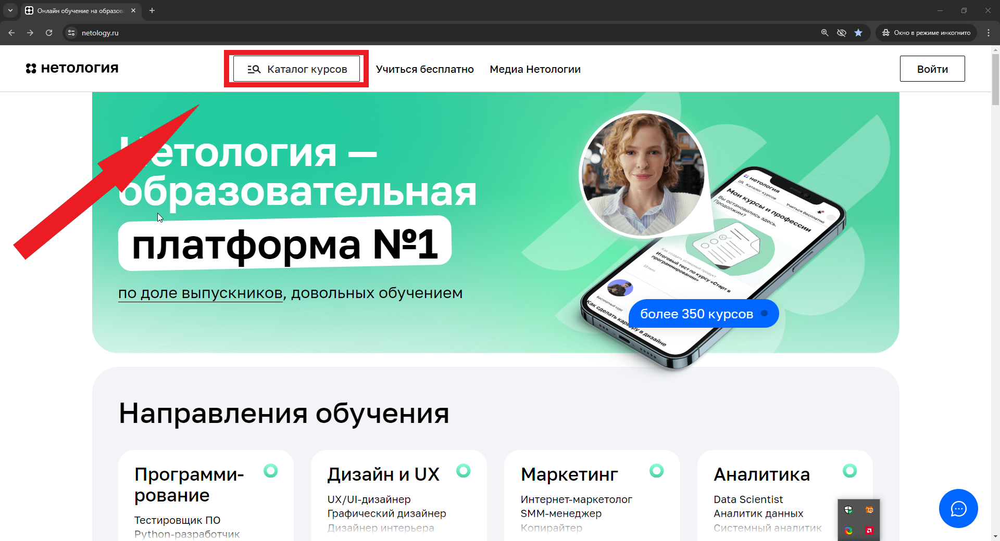
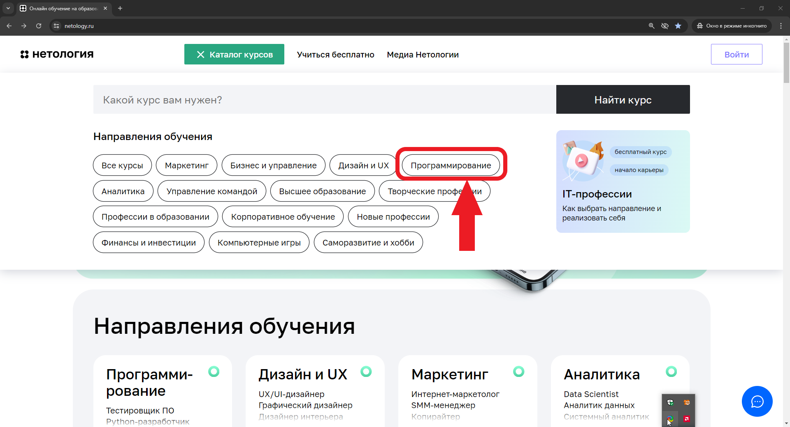
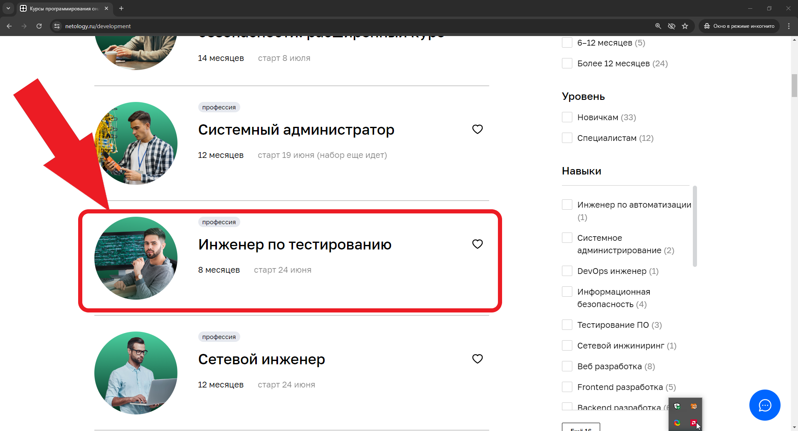
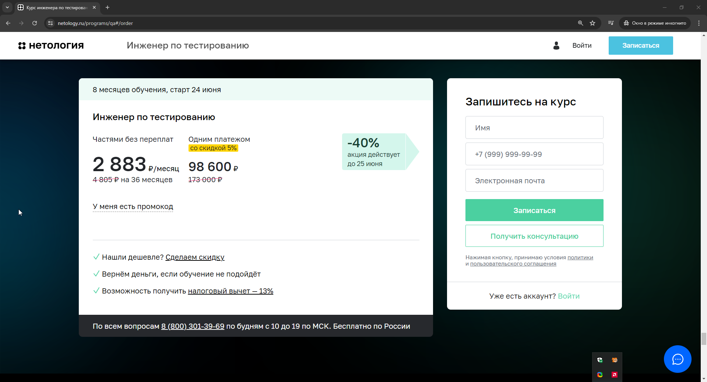
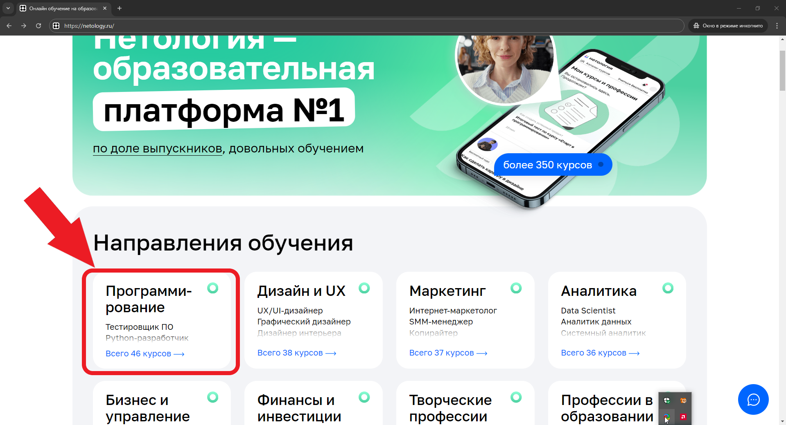

# План автоматизации тестирования возможности записаться на обучение профессии «Инженер по тестированию»

### Объект тестирования:  форма записи на курс "Инженер по тестированию" на веб-сайте Нетология (https://netology.ru/).

#### Цель тестирования: план автоматизации тестирования сценария перехода к форме записи и заполнения этой формы.

# Перечень автоматизируемых сценариев:
### Предусловия:

* Переход к форме записи на курс "«Инженер по тестированию»" :

Открыть стартовую страницу сайта Нетология (https://netology.ru/).

Попасть на страницу формы записи (https://netology.ru/programs/qa) со страницы профессии можно двумя способами: 

 ## * Сценарий №1:

### 1.  нажать кнопку "Каталог курсов";

### 2.  нажать в появившемся всплывающем окне "Программирование" (переход на страницу https://netology.ru/development);

### 3.  прокрутить страницу вниз и выбрать "Инженер по тестированию";

### 4.  нажать кнопку "Записаться" или прокрутить страницу вниз до формы записи (https://netology.ru/programs/qa#/order).

## * Сценарий №2:

### 1.  пролистать страницу вниз и выбрать из меню Направления обучения профессию Программирование;
   

### 2.  прокрутить страницу вниз и выбрать "Инженер по тестированию";
   

### 3.  нажать кнопку "Записаться" или прокрутить страницу вниз до формы записи (https://netology.ru/programs/qa#/order).
   
4. 

### Тестовые сценарии:
## Позитивные:
* Пользователь не зарегистрирован или не авторизован на сайте

В поле «Имя» ввести валидное значение (короткое имя, длинное имя, имя в нижнем регистре, имя в верхнем регистре двойное имя через дефис, двойное имя через пробел, имя с буквой Ё, имя на латинице);

В поле «Номера телефона» ввести валидное значение  (номер в формате +7 (999) 999-99-99);

В поле «Электронная почта» ввести валидное (email в нижнем регистре, email в верхнем регистре, email с цифрами в имени аккаунта или в доменной части, email с дефисом в имени аккаунта или доменной части, email с точками в имени аккаунта, email с несколькими точками в доменной части);

**Ожидаемый результат:** На электронный адрес приходит письмо с подтверждением заявки. Переход на страницу оплаты.

 * Пользователь зарегистрирован и авторизован на сайте

В поле «Имя» ввести валидное значение ранее зарегистрированного пользователя (короткое имя, длинное имя, имя в нижнем регистре, имя в верхнем регистре двойное имя через дефис, двойное имя через пробел, имя с буквой Ё, имя на латинице);

В поле «Номера телефона» ввести валидное значение  (номер в формате +7 (999) 999-99-99);

В поле «Электронная почта» ввести валидное (email в нижнем регистре, email в верхнем регистре, email с цифрами в имени аккаунта или в доменной части, email с дефисом в имени аккаунта или доменной части, email с точками в имени аккаунта, email с несколькими точками в доменной части);

**Ожидаемый результат:** На электронный адрес приходит письмо с подтверждением заявки. Переход на страницу оплаты.

## Негативные:

- Оставить поле/поля формы/форм пустыми. 
**Ожидаемый результат:** форма не отправляется, поле/поля подсвечиваются с ошибкой "Обязательное поле".

- Заполнить поле «Имя» не валидными данными (одна буква, спе.символы в имени, длинна более 128 символов, иероглифы вместо символов кириллицы или латиницы, пробелы вместо букв). 
**Ожидаемый результат:** имя некорректное, поле «Имя» подсвечивается красным цветом, сообщение об ошибке: «Должно состоять из букв»

- Заполнить поле «Номер телефона» не валидными данными (номер телефона без знака + в начале, номер телефона более/менее 11 цифр). 
**Ожидаемый результат:** поле «Номер телефона» подсвечивается красным цветом, сообщение об ошибке: «Номер в формате +7 (999) 999-99-99».

- Заполнить поле "Электронная почта" не валидными данными (Превышение длинны email(более 320 символов), адрес почты без знака @ , пробелы в имени и/или доменной части, отсутствие точки в доменной части, email без имени или доменной части, некорректный домен первого уровня (допустимо 2-63 букв после точки)). 
**Ожидаемый результат:** поле «Электронный адрес» подсвечивается красным цветом, сообщение об ошибке: «Неверный email».

- Форма для авторизованного пользователя не содержит поле "Электронная почта", поэтому тесты для проверки этого поля «Электронная почта» отсутствуют.

### Перечень используемых инструментов:
1. [ ] IntelliJ IDEA- интегрированная среда разработки ПО для многих языков программирования и создания автотестов. 
2. [ ] Java 11 - объектно-ориентированный язык программирования, оптимальный для написания понятных и наглядных автотестов.
3. [ ] JUnit 5 - инструмент тестирования, среда модульного тестирования для языка программирования Java.
4. [ ] Gradle - система автоматической сборки проектов, которая используется для упрощения работы с JAVA.
5. [ ] Selenide - фреймворк для автоматизированного тестирования веб-приложений на основе Selenium WebDriver, дающий следующие преимущества: изящный API, поддержка AJAX для стабильных тестов, мощные селекторы, простая конфигурация.
6. [ ] Faker - библиотека, которая позволяет генерировать случайные данные. С ее помощью можно заполнить таблицы в базе данных, построить корректные XML-документы, сформировать JSON-ответы для REST.

### Перечень необходимых разрешений/данных/доступов:

* Необходимо разрешение на проведение тестирования и автоматизации на веб-сайте Нетология
* Нужен доступ к API и БД (доступ к действующей базе данных несет определенные риски) для проверки результатов выполнения тестов.
* Техническая документация, для понимания валидных и невалидных данных.

### Перечень и описание возможных рисков при автоматизации:
1. Отсутствие технической документации.
2. Не значительное изменение реализации веб-элементов на странице, могут привести к падению ранее написаных авто-тестов.
3. Автотесты не проверяют графический интерфейс (GUI) сайта.
4. Возможно "Замусовариние" бызы данных.
5. Ложные срабытывания при отправке форм, что в свою очередь может увеличить нагрузку по обработке данных

### Перечень необходимых специалистов для автоматизации:

* Cпециалист по автоматизированному тестированию.

### Интервальная оценка с учетом рисков (в часах):
Осуществлене Плана тестирования по автоматизации потребуется 30-40 рабочих часов.
